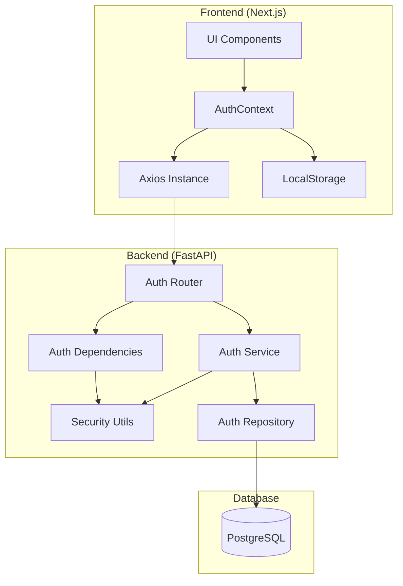
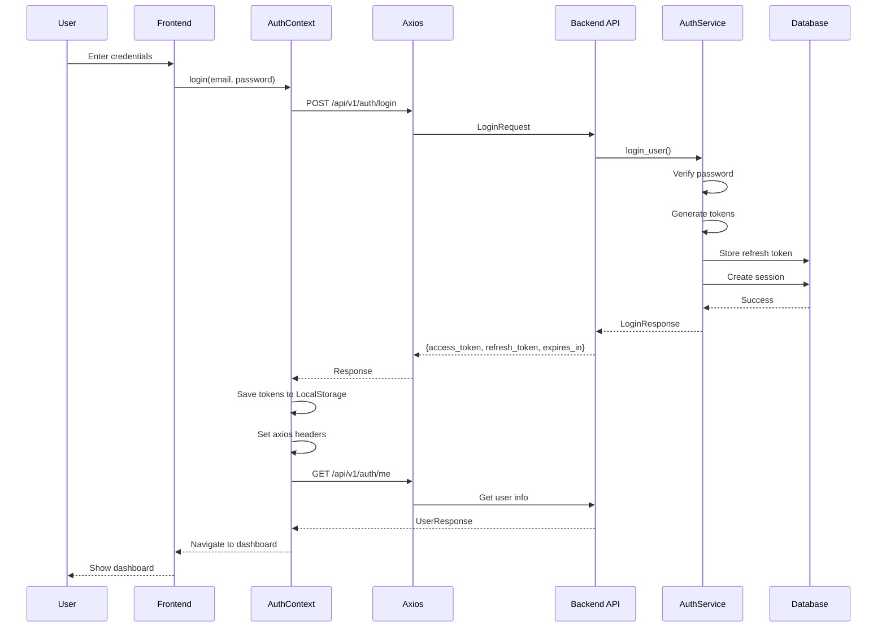
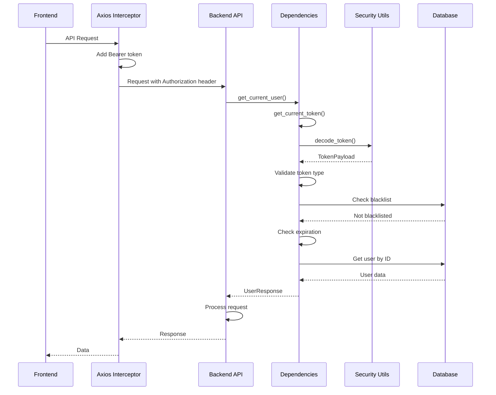
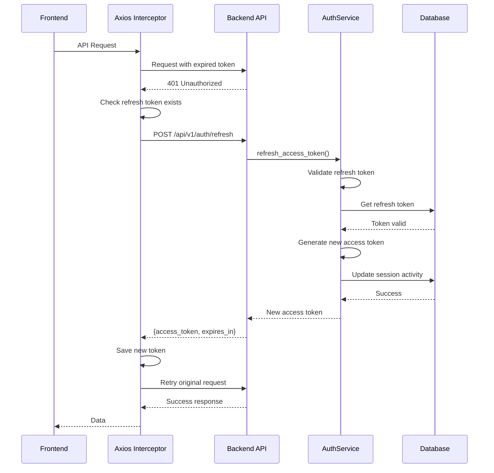
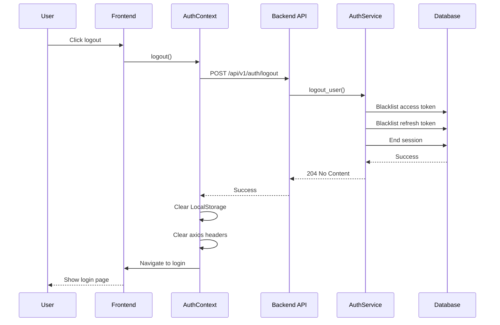

# JWT Authentication Flow Documentation

## Table of Contents
1. [Overview](#overview)
2. [System Architecture](#system-architecture)
3. [Authentication Flows](#authentication-flows)
4. [Component Details](#component-details)
5. [Security Features](#security-features)
6. [API Reference](#api-reference)

## Overview

This document provides a comprehensive guide to the JWT (JSON Web Token) authentication system implemented in Resume Genius. The system uses a dual-token approach with access tokens for API requests and refresh tokens for obtaining new access tokens.

### Key Components
- **Frontend**: Next.js 15 with TypeScript, React Context for auth state management
- **Backend**: FastAPI with JWT token generation and validation
- **Token Storage**: LocalStorage for tokens, PostgreSQL for refresh tokens and blacklisting

## System Architecture



## Authentication Flows

### 1. Login Flow



#### Code Execution Path - Login

**Frontend (TypeScript)**

1. **User Interface** - Login form submission
```typescript
// Example login form component
const handleSubmit = async (e: FormEvent) => {
  e.preventDefault();
  await login({ email, password, remember_me: false });
};
```
**Explanation:** This is a typical form submission handler that prevents the default form submission behavior and calls the `login` function from AuthContext with the user's credentials. The `remember_me` flag determines whether the refresh token expires in 7 days (false) or 30 days (true).

2. **AuthContext.tsx:104-122** - `login` function
```typescript
const login = useCallback(
  async (credentials: UserLoginRequest) => {
    try {
      const data = await loginApiV1AuthLoginPost(credentials);
      const { access_token, refresh_token, expires_in } = data;
      
      saveTokens(access_token, refresh_token, expires_in);
      await fetchUser();
      
      toast.success("Successfully logged in!");
      router.push("/dashboard");
    } catch (error: any) {
      const message = error.response?.data?.detail || "Login failed";
      toast.error(message);
      throw error;
    }
  },
  [saveTokens, fetchUser, router]
);
```
**Explanation:** This function orchestrates the entire login process on the frontend:
- Calls the login API endpoint with user credentials
- Extracts the JWT tokens and expiration time from the response
- Stores tokens in localStorage and sets axios headers via `saveTokens`
- Fetches the current user's profile information
- Shows a success notification and redirects to the dashboard
- Handles errors by displaying error messages and re-throwing for component-level handling

3. **AuthContext.tsx:68-79** - `saveTokens` function stores tokens
```typescript
const saveTokens = useCallback(
  (accessToken: string, refreshToken: string, expiresIn: number) => {
    localStorage.setItem(TOKEN_KEY, accessToken);
    localStorage.setItem(REFRESH_TOKEN_KEY, refreshToken);
    const expiryTime = new Date().getTime() + expiresIn * 1000;
    localStorage.setItem(TOKEN_EXPIRY_KEY, expiryTime.toString());
    
    // Update axios default header
    axiosInstance.defaults.headers.common["Authorization"] = `Bearer ${accessToken}`;
  },
  []
);
```
**Explanation:** This function persists authentication tokens and configures axios for authenticated requests:
- Stores the access token in localStorage for API requests
- Stores the refresh token for obtaining new access tokens when they expire
- Calculates and stores the exact expiration timestamp (current time + expires_in seconds)
- Sets the Authorization header globally on axios so all subsequent API requests automatically include the bearer token

**Backend (Python)**

4. **auth.py:65-88** - `/login` endpoint
```python
@router.post("/login", response_model=UserLoginResponse)
async def login(
    request: UserLoginRequest,
    req: Request,
    repository: AuthRepository = Depends(get_auth_repository),
    security: SecurityUtils = Depends(get_security_utils),
    config: AuthConfig = Depends(get_auth_config),
) -> UserLoginResponse:
    service = AuthService(repository, security, config)
    ip_address = req.client.host if req.client else "127.0.0.1"
    user_agent = req.headers.get("user-agent")
    
    try:
        return await service.login_user(request, ip_address, user_agent)
    except ValueError as e:
        raise HTTPException(status_code=status.HTTP_401_UNAUTHORIZED, detail=str(e))
```
**Explanation:** This FastAPI endpoint handler receives login requests and coordinates the authentication process:
- Uses dependency injection to get repository, security utilities, and configuration
- Creates an AuthService instance with the injected dependencies
- Extracts client information (IP address and user agent) for session tracking and security logging
- Delegates the actual authentication logic to the service layer
- Converts service-level ValueError exceptions into HTTP 401 responses with appropriate error messages

5. **auth_service.py:74-161** - `login_user` method
```python
async def login_user(self, request: UserLoginRequest, ip_address: str, user_agent: Optional[str] = None) -> UserLoginResponse:
    # Get user
    user = await self.repository.get_user_by_email(request.email)
    if not user:
        raise ValueError("Invalid email or password")
    
    # Check if user is active
    if not user.is_active:
        raise ValueError("Account is deactivated")
    
    # Verify password
    if not self.security.verify_password(request.password, auth_provider.password_hash):
        await self.repository.update_login_attempt(auth_provider, success=False)
        await self.repository.commit()
        raise ValueError("Invalid email or password")
    
    # Generate session ID and tokens
    session_id = self.security.generate_session_id()
    access_token = self.security.create_access_token(str(user.id), session_id)
    refresh_token = self.security.create_refresh_token(str(user.id), session_id)
    
    # Store refresh token and create session
    # ... (database operations)
    
    return UserLoginResponse(
        access_token=access_token,
        refresh_token=refresh_token,
        token_type="bearer",
        expires_in=self.config.access_token_expire_minutes * 60,
    )
```
**Explanation:** This service method contains the core authentication business logic:
- Retrieves the user from the database by email
- Returns generic "Invalid email or password" error to prevent user enumeration attacks
- Verifies the account is active (not suspended or deleted)
- Uses bcrypt to verify the provided password against the stored hash
- Tracks failed login attempts for security monitoring and account lockout
- Generates a unique session ID to link the access and refresh tokens
- Creates both JWT tokens with appropriate expiration times
- Stores the refresh token hash in the database for validation during refresh
- Creates a user session record for tracking and management
- Returns the tokens with expiration information in seconds

6. **security.py:32-51** - Token generation
```python
def create_access_token(self, user_id: str, session_id: Optional[str] = None) -> str:
    now = datetime.now(timezone.utc)
    expire = now + timedelta(minutes=self.config.access_token_expire_minutes)
    jti = secrets.token_urlsafe(32)  # Unique token ID for blacklisting
    
    payload = {
        "sub": user_id,
        "exp": expire,
        "iat": now,
        "jti": jti,
        "token_type": "access",
        "session_id": session_id,
    }
    
    return jwt.encode(
        payload, self.config.jwt_secret_key, algorithm=self.config.jwt_algorithm
    )
```
**Explanation:** This function creates a JWT access token with security features:
- Uses UTC timestamps to avoid timezone issues
- Sets expiration time based on configuration (default 30 minutes)
- Generates a cryptographically secure random JTI (JWT ID) for token blacklisting capability
- Includes the user ID as the subject (sub) claim
- Adds issued-at (iat) timestamp for token age validation
- Includes token type to distinguish from refresh tokens
- Links to session for coordinated session management
- Signs the token with the secret key using HS256 algorithm (configurable)

### 2. Protected Route Access Flow



#### Code Execution Path - Protected Routes

**Frontend (TypeScript)**

1. **axios-instance.ts:33-45** - Request interceptor adds token
```typescript
axiosInstance.interceptors.request.use(
  (config: InternalAxiosRequestConfig) => {
    const token = localStorage.getItem('access_token');
    if (token && config.headers) {
      config.headers.Authorization = `Bearer ${token}`;
    }
    return config;
  },
  (error) => {
    return Promise.reject(error);
  }
);
```
**Explanation:** This axios request interceptor automatically adds authentication to all outgoing requests:
- Intercepts every HTTP request before it's sent to the server
- Retrieves the access token from localStorage
- If a token exists, adds it as a Bearer token in the Authorization header
- This eliminates the need to manually add authentication headers to each API call
- If there's an error in the interceptor, it's passed through for handling

**Backend (Python)**

2. **jobs.py:147-162** - Protected endpoint example
```python
@router.post("/jobs/create", response_model=CreateJobResponse)
async def create_job(
    input_body: CreateJobRequest,
    background_tasks: BackgroundTasks,
    current_user: UserResponse = Depends(get_current_user),  # JWT validation here
):
    user_id = uuid.UUID(current_user.id)
    job_id = uuid.uuid4()
    # ... rest of the implementation
```
**Explanation:** This shows how protected endpoints use JWT authentication:
- The `Depends(get_current_user)` dependency automatically validates the JWT token
- If validation fails, the request is rejected before reaching the endpoint logic
- If successful, the authenticated user's information is injected as `current_user`
- The endpoint can then use the user's ID to ensure data isolation and proper authorization
- No manual token parsing is needed in the endpoint implementation

3. **dependencies.py:142-175** - `get_current_user` dependency
```python
async def get_current_user(
    token_payload: TokenPayload = Depends(get_current_token),
    repository: AuthRepository = Depends(get_auth_repository),
) -> UserResponse:
    # Get user from database
    user = await repository.get_user_by_id(token_payload.sub)
    if not user:
        raise HTTPException(
            status_code=status.HTTP_404_NOT_FOUND, detail="User not found"
        )
    
    # Convert to response schema
    return UserResponse(
        id=str(user.id),
        email=user.email,
        first_name=user.first_name,
        last_name=user.last_name,
        # ... other fields
    )
```
**Explanation:** This dependency retrieves the authenticated user's information:
- First calls `get_current_token` to validate and decode the JWT
- Uses the user ID from the token payload (sub claim) to fetch user from database
- Returns 404 if the user no longer exists (e.g., deleted account)
- Converts the database model to a Pydantic response model
- This ensures every protected endpoint has access to full user information
- The user data is cached per request to avoid multiple database queries

4. **dependencies.py:77-139** - `get_current_token` dependency
```python
async def get_current_token(
    credentials: Optional[HTTPAuthorizationCredentials] = Depends(security_scheme),
    oauth2_token: Optional[str] = Depends(oauth2_scheme),
    security: SecurityUtils = Depends(get_security_utils),
    repository: AuthRepository = Depends(get_auth_repository),
) -> TokenPayload:
    # Extract token from header
    token = None
    if credentials and credentials.credentials:
        token = credentials.credentials
    elif oauth2_token:
        token = oauth2_token
    
    if not token:
        raise HTTPException(
            status_code=status.HTTP_401_UNAUTHORIZED,
            detail="Not authenticated",
        )
    
    # Decode and validate token
    token_payload = security.decode_token(token)
    if not token_payload:
        raise HTTPException(
            status_code=status.HTTP_401_UNAUTHORIZED,
            detail="Invalid authentication token",
        )
    
    # Check token type
    if token_payload.token_type != "access":
        raise HTTPException(
            status_code=status.HTTP_401_UNAUTHORIZED,
            detail="Invalid token type",
        )
    
    # Check blacklist
    if token_payload.jti and await repository.is_token_blacklisted(token_payload.jti):
        raise HTTPException(
            status_code=status.HTTP_401_UNAUTHORIZED,
            detail="Token has been revoked",
        )
    
    # Check expiration
    if security.is_token_expired(token_payload):
        raise HTTPException(
            status_code=status.HTTP_401_UNAUTHORIZED,
            detail="Token has expired",
        )
    
    return token_payload
```
**Explanation:** This is the core JWT validation logic that runs for every protected endpoint:
- Supports both HTTPBearer (standard) and OAuth2PasswordBearer (for Swagger UI) authentication schemes
- Extracts the token from the Authorization header
- Returns 401 if no token is provided
- Decodes the JWT and validates its signature using the secret key
- Verifies it's an access token (not a refresh token being misused)
- Checks if the token's JTI is in the blacklist (for revoked tokens after logout)
- Validates the token hasn't expired based on the exp claim
- Returns the validated token payload for use by other dependencies
- All validation failures result in 401 Unauthorized with specific error messages

### 3. Token Refresh Flow



#### Code Execution Path - Token Refresh

**Frontend (TypeScript)**

1. **axios-instance.ts:47-129** - Response interceptor handles 401
```typescript
axiosInstance.interceptors.response.use(
  (response) => response,
  async (error: AxiosError) => {
    const originalRequest = error.config as InternalAxiosRequestConfig & { _retry?: boolean };
    
    if (error.response?.status === 401 && originalRequest && !originalRequest._retry) {
      if (isRefreshing) {
        // Queue request while refreshing
        return new Promise((resolve, reject) => {
          failedQueue.push({ resolve, reject });
        }).then((token) => {
          originalRequest.headers.Authorization = `Bearer ${token}`;
          return axiosInstance(originalRequest);
        });
      }
      
      originalRequest._retry = true;
      isRefreshing = true;
      
      const refreshToken = localStorage.getItem('refresh_token');
      
      if (!refreshToken) {
        // Redirect to login
        window.location.href = '/auth/sign-in';
        return Promise.reject(error);
      }
      
      try {
        const { refreshTokenApiV1AuthRefreshPost } = await import('./generated/api');
        const data = await refreshTokenApiV1AuthRefreshPost({ refresh_token: refreshToken });
        
        const { access_token, expires_in } = data;
        
        // Save new token
        localStorage.setItem('access_token', access_token);
        const expiryTime = new Date().getTime() + expires_in * 1000;
        localStorage.setItem('token_expiry', expiryTime.toString());
        
        axiosInstance.defaults.headers.common['Authorization'] = `Bearer ${access_token}`;
        processQueue(null, access_token);
        
        // Retry original request
        originalRequest.headers.Authorization = `Bearer ${access_token}`;
        return axiosInstance(originalRequest);
      } catch (refreshError) {
        // Clear tokens and redirect to login
        localStorage.removeItem('access_token');
        localStorage.removeItem('refresh_token');
        localStorage.removeItem('token_expiry');
        delete axiosInstance.defaults.headers.common['Authorization'];
        
        window.location.href = '/auth/sign-in';
        return Promise.reject(refreshError);
      } finally {
        isRefreshing = false;
      }
    }
    
    return Promise.reject(error);
  }
);
```
**Explanation:** This response interceptor handles automatic token refresh when the access token expires:
- Intercepts all HTTP responses to check for 401 Unauthorized errors
- Uses a `_retry` flag to prevent infinite retry loops
- Implements a queue system to handle concurrent requests during token refresh:
  - If already refreshing, queues the request to wait for the new token
  - Prevents multiple simultaneous refresh attempts (race condition prevention)
- If no refresh token exists, redirects to login immediately
- Dynamically imports the refresh API to avoid circular dependencies
- On successful refresh:
  - Updates localStorage with the new access token and expiry
  - Updates the axios default Authorization header
  - Processes all queued requests with the new token
  - Retries the original failed request
- On refresh failure:
  - Clears all authentication data
  - Redirects to login page
  - This handles cases like expired refresh tokens or revoked sessions

**Backend (Python)**

2. **auth.py:145-169** - `/refresh` endpoint
```python
@router.post("/refresh", response_model=RefreshTokenResponse)
async def refresh_token(
    request: RefreshTokenRequest,
    req: Request,
    repository: AuthRepository = Depends(get_auth_repository),
    security: SecurityUtils = Depends(get_security_utils),
    config: AuthConfig = Depends(get_auth_config),
) -> RefreshTokenResponse:
    service = AuthService(repository, security, config)
    ip_address = req.client.host if req.client else "127.0.0.1"
    user_agent = req.headers.get("user-agent")
    
    try:
        return await service.refresh_access_token(request, ip_address, user_agent)
    except ValueError as e:
        raise HTTPException(status_code=status.HTTP_401_UNAUTHORIZED, detail=str(e))
```
**Explanation:** This endpoint handles refresh token requests to obtain new access tokens:
- Accepts a refresh token in the request body (not in Authorization header for security)
- Uses dependency injection to get necessary services
- Captures client information for security auditing
- Delegates to the auth service for token validation and generation
- Returns 401 for any validation failures (invalid/expired/revoked refresh tokens)

3. **auth_service.py:163-210** - `refresh_access_token` method
```python
async def refresh_access_token(
    self,
    request: RefreshTokenRequest,
    ip_address: str,
    user_agent: Optional[str] = None,
) -> RefreshTokenResponse:
    # Decode refresh token
    token_payload = self.security.decode_token(request.refresh_token)
    if not token_payload or token_payload.token_type != "refresh":
        raise ValueError("Invalid refresh token")
    
    # Check if token is blacklisted
    if await self.repository.is_token_blacklisted(token_payload.jti):
        raise ValueError("Token has been revoked")
    
    # Hash token and get from database
    token_hash = self.security.hash_token(request.refresh_token)
    refresh_token_model = await self.repository.get_refresh_token(token_hash)
    if not refresh_token_model:
        raise ValueError("Invalid refresh token")
    
    # Get user
    user = await self.repository.get_user_by_id(token_payload.sub)
    if not user or not user.is_active:
        raise ValueError("User not found or inactive")
    
    # Update refresh token last used
    refresh_token_model.last_used_at = datetime.now(timezone.utc)
    
    # Update session activity
    if token_payload.session_id:
        await self.repository.update_session_activity(token_payload.session_id)
    
    # Create new access token
    access_token = self.security.create_access_token(
        str(user.id), token_payload.session_id
    )
    
    await self.repository.commit()
    
    return RefreshTokenResponse(
        access_token=access_token,
        token_type="bearer",
        expires_in=self.config.access_token_expire_minutes * 60,
    )
```
**Explanation:** This method implements the secure refresh token validation and new token generation:
- Decodes the refresh token and validates it's the correct token type
- Checks if the token's JTI is blacklisted (prevents reuse after logout)
- Validates the refresh token exists in the database (double validation)
- Verifies the user still exists and is active (handles deleted/suspended accounts)
- Updates tracking information:
  - Records when the refresh token was last used
  - Updates session activity timestamp
- Generates a new access token with the same session ID (maintains session continuity)
- Returns only a new access token (refresh token remains the same for security)
- The refresh token has a longer lifespan and is only replaced on re-authentication

### 4. Logout Flow



## Component Details

### Frontend Components

#### AuthContext (apps/frontend/src/contexts/AuthContext.tsx)

The AuthContext manages authentication state and provides authentication methods throughout the application.

**Key Functions:**
- `login(credentials)` - Authenticates user and stores tokens
- `logout()` - Clears tokens and ends session
- `refreshSession()` - Refreshes access token using refresh token
- `fetchUser()` - Retrieves current user information

**Token Storage:**
- Access Token: `localStorage.getItem('access_token')`
- Refresh Token: `localStorage.getItem('refresh_token')`
- Token Expiry: `localStorage.getItem('token_expiry')`

#### Axios Instance (apps/frontend/src/lib/api/axios-instance.ts)

Configured axios instance with interceptors for automatic token injection and refresh.

**Features:**
- Request interceptor adds Bearer token to all requests
- Response interceptor handles 401 errors and triggers token refresh
- Queue system for requests during token refresh
- Automatic retry after successful refresh

### Backend Components

#### Auth Router (apps/backend/src/api/routers/auth.py)

FastAPI router defining authentication endpoints:
- `POST /auth/register` - User registration
- `POST /auth/login` - User login
- `POST /auth/token` - OAuth2 compatible token endpoint
- `POST /auth/refresh` - Token refresh
- `POST /auth/logout` - User logout
- `GET /auth/me` - Get current user
- `GET /auth/verify-token` - Verify token validity

#### Dependencies (apps/backend/src/api/dependencies.py)

Dependency injection functions for authentication:
- `get_current_token()` - Extracts and validates JWT token
- `get_current_user()` - Returns authenticated user
- `get_current_active_user()` - Ensures user is active
- `get_optional_current_user()` - Optional authentication

#### Security Utils (apps/backend/src/core/security.py)

Core security functions:
- `create_access_token()` - Generates access JWT
- `create_refresh_token()` - Generates refresh JWT
- `decode_token()` - Decodes and validates JWT
- `hash_password()` - Bcrypt password hashing
- `verify_password()` - Password verification

#### Auth Service (apps/backend/src/services/auth_service.py)

Business logic for authentication:
- `register_user()` - User registration logic
- `login_user()` - Authentication and session creation
- `refresh_access_token()` - Token refresh logic
- `logout_user()` - Token revocation and session ending

## Security Features

### Token Structure

```python
# Access Token Payload
{
    "sub": "user_id",           # User UUID - identifies the token owner
    "exp": 1234567890,          # Expiration timestamp - when token becomes invalid
    "iat": 1234567890,          # Issued at timestamp - when token was created
    "jti": "unique_token_id",   # JWT ID - unique identifier for blacklisting
    "token_type": "access",     # Token type - distinguishes from refresh tokens
    "session_id": "session_id"  # Session ID - links to user session for management
}

# Refresh Token Payload
{
    "sub": "user_id",           # User UUID - same as access token
    "exp": 1234567890,          # Longer expiration (7-30 days vs 30 minutes)
    "iat": 1234567890,          # Issued at timestamp
    "jti": "unique_token_id",   # Different JTI from access token
    "token_type": "refresh",    # Identifies as refresh token
    "session_id": "session_id"  # Same session ID as paired access token
}
```
**Explanation of Token Claims:**
- **sub (Subject)**: The user's UUID from the database, used to identify who the token belongs to
- **exp (Expiration)**: Unix timestamp when the token expires and can no longer be used
- **iat (Issued At)**: Unix timestamp when the token was created, used for age validation
- **jti (JWT ID)**: A cryptographically random unique identifier that allows individual tokens to be blacklisted
- **token_type**: Prevents token confusion attacks by explicitly identifying the token's purpose
- **session_id**: Links tokens to a specific login session, allowing coordinated session management

### Security Measures

1. **Token Blacklisting**
   - JTI (JWT ID) stored in database when tokens are revoked
   - Checked on every request in `get_current_token()`
   - Prevents use of tokens after logout

2. **Session Management**
   - Each login creates a unique session
   - Sessions track IP address and user agent
   - Sessions can be terminated independently

3. **Failed Login Protection**
   - Failed attempts tracked per auth provider
   - Account lockout after threshold (configurable)
   - Automatic unlock after timeout period

4. **Token Expiration**
   - Access tokens: 30 minutes (configurable)
   - Refresh tokens: 7 days or 30 days with "remember me"
   - Automatic refresh before expiration in frontend

5. **Password Security**
   - Bcrypt hashing with salt
   - Configurable cost factor
   - No plain text storage

## API Reference

### Authentication Endpoints

#### POST /api/v1/auth/login
**Request:**
```json
{
  "email": "user@example.com",
  "password": "password123",
  "remember_me": false
}
```

**Response:**
```json
{
  "access_token": "eyJ...",
  "refresh_token": "eyJ...",
  "token_type": "bearer",
  "expires_in": 1800
}
```

#### POST /api/v1/auth/refresh
**Request:**
```json
{
  "refresh_token": "eyJ..."
}
```

**Response:**
```json
{
  "access_token": "eyJ...",
  "token_type": "bearer",
  "expires_in": 1800
}
```

#### GET /api/v1/auth/me
**Headers:**
```
Authorization: Bearer eyJ...
```

**Response:**
```json
{
  "id": "uuid",
  "email": "user@example.com",
  "first_name": "John",
  "last_name": "Doe",
  "is_active": true,
  "email_verified": false
}
```

### Protected Endpoints

All protected endpoints require the Authorization header:
```
Authorization: Bearer <access_token>
```

Example usage in jobs router:
```python
@router.post("/jobs/create")
async def create_job(
    input_body: CreateJobRequest,
    current_user: UserResponse = Depends(get_current_user),
):
    user_id = uuid.UUID(current_user.id)
    # Implementation
```

## Configuration

### Backend Configuration (apps/backend/src/config/auth.py)

```python
class AuthConfig:
    jwt_secret_key: str                      # Secret key for JWT signing
    jwt_algorithm: str = "HS256"             # JWT algorithm
    access_token_expire_minutes: int = 30    # Access token lifetime
    refresh_token_expire_days: int = 7       # Refresh token lifetime
    password_reset_token_expire_hours: int = 24
    email_verification_token_expire_hours: int = 48
```

### Frontend Configuration

Token storage keys in LocalStorage:
- `access_token` - Current access token
- `refresh_token` - Current refresh token
- `token_expiry` - Token expiration timestamp

## Troubleshooting

### Common Issues

1. **401 Unauthorized Errors**
   - Check token expiration
   - Verify token is included in request headers
   - Ensure user is active
   - Check if token is blacklisted

2. **Token Refresh Failures**
   - Verify refresh token is valid
   - Check refresh token expiration
   - Ensure refresh token isn't blacklisted
   - Verify user account is active

3. **CORS Issues**
   - Ensure backend CORS configuration allows frontend origin
   - Check if Authorization header is allowed

## Testing Authentication

### Manual Testing with cURL

1. **Login:**
```bash
curl -X POST http://localhost:8000/api/v1/auth/login \
  -H "Content-Type: application/json" \
  -d '{"email": "test@example.com", "password": "password123"}'
```

2. **Access Protected Route:**
```bash
TOKEN="your_access_token_here"
curl -X GET http://localhost:8000/api/v1/auth/me \
  -H "Authorization: Bearer $TOKEN"
```

3. **Refresh Token:**
```bash
REFRESH_TOKEN="your_refresh_token_here"
curl -X POST http://localhost:8000/api/v1/auth/refresh \
  -H "Content-Type: application/json" \
  -d "{\"refresh_token\": \"$REFRESH_TOKEN\"}"
```

### Frontend Testing

```typescript
// Test authentication in browser console
const testAuth = async () => {
  // Login
  const loginResponse = await fetch('/api/v1/auth/login', {
    method: 'POST',
    headers: { 'Content-Type': 'application/json' },
    body: JSON.stringify({
      email: 'test@example.com',
      password: 'password123'
    })
  });
  const { access_token } = await loginResponse.json();
  
  // Use token for protected route
  const meResponse = await fetch('/api/v1/auth/me', {
    headers: { 'Authorization': `Bearer ${access_token}` }
  });
  const user = await meResponse.json();
  console.log('Current user:', user);
};
```

## Summary

The JWT authentication system provides a secure, scalable solution for user authentication with the following key features:

1. **Dual-token approach** for security and user experience
2. **Automatic token refresh** to maintain seamless sessions
3. **Comprehensive security measures** including blacklisting and session management
4. **Clean separation of concerns** between frontend and backend
5. **Type-safe implementation** with TypeScript and Pydantic models

For implementation details, refer to the specific file paths and line numbers provided throughout this documentation.