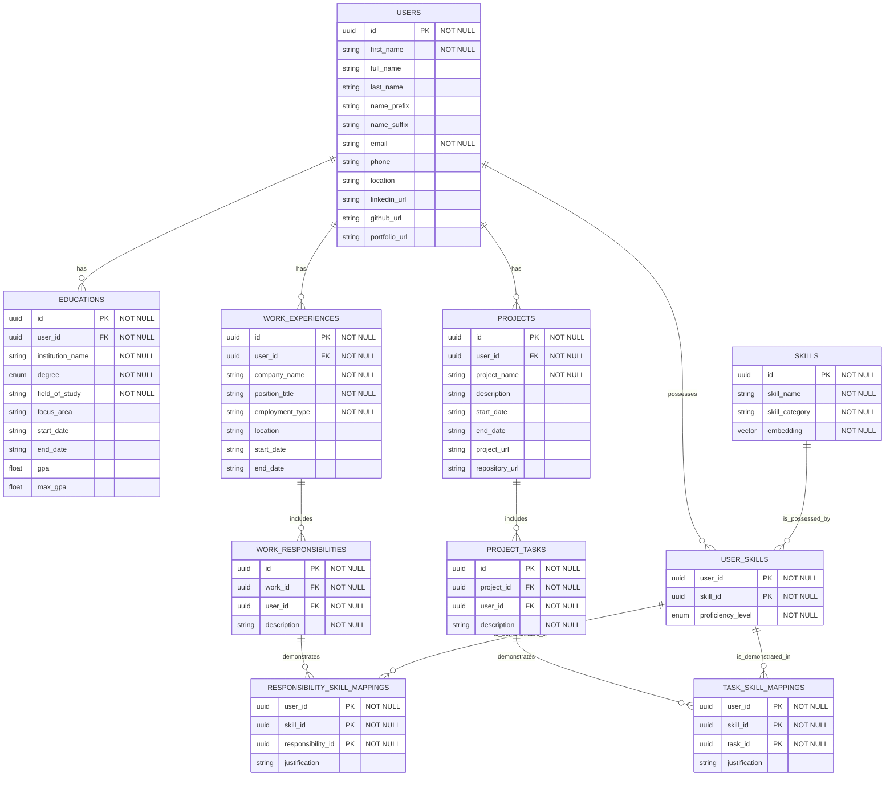

```mermaid
erDiagram
	USERS {
		uuid id PK "NOT NULL"
		string first_name  "NOT NULL"
		string full_name  ""
		string last_name  ""
		string name_prefix  ""
		string name_suffix  ""
		string email  "NOT NULL"
		string phone  ""
		string location  ""
		string linkedin_url  ""
		string github_url  ""
		string portfolio_url  ""
	}

	EDUCATIONS {
		uuid id PK "NOT NULL"
		uuid user_id FK "NOT NULL"
		string institution_name  "NOT NULL"
		enum degree  "NOT NULL"
		string field_of_study  "NOT NULL"
		string focus_area  ""
		string start_date  ""
		string end_date  ""
		float gpa  ""
		float max_gpa  ""
	}

	WORK_EXPERIENCES {
		uuid id PK "NOT NULL"
		uuid user_id FK "NOT NULL"
		string company_name  "NOT NULL"
		string position_title  "NOT NULL"
		string employment_type  "NOT NULL"
		string location  ""
		string start_date  ""
		string end_date  ""
	}

	WORK_RESPONSIBILITIES {
		uuid id PK "NOT NULL"
		uuid work_id FK "NOT NULL"
		uuid user_id FK "NOT NULL"
		string description  "NOT NULL"
	}

	PROJECTS {
		uuid id PK "NOT NULL"
		uuid user_id FK "NOT NULL"
		string project_name  "NOT NULL"
		string description  ""
		string start_date  ""
		string end_date  ""
		string project_url  ""
		string repository_url  ""
	}

	PROJECT_TASKS {
		uuid id PK "NOT NULL"
		uuid project_id FK "NOT NULL"
		uuid user_id FK "NOT NULL"
		string description  "NOT NULL"
	}

	SKILLS {
		uuid id PK "NOT NULL"
		string skill_name  "NOT NULL"
		string skill_category  "NOT NULL"
		vector embedding  "NOT NULL"
	}

	USER_SKILLS {
		uuid user_id PK "NOT NULL"
		uuid skill_id PK "NOT NULL"
		enum proficiency_level  "NOT NULL"
	}

	TASK_SKILL_MAPPINGS {
		uuid user_id PK "NOT NULL"
		uuid skill_id PK "NOT NULL"
		uuid task_id PK "NOT NULL"
		string justification ""
	}

	RESPONSIBILITY_SKILL_MAPPINGS {
		uuid user_id PK "NOT NULL"
		uuid skill_id PK "NOT NULL"
		uuid responsibility_id PK "NOT NULL"
		string justification ""
	}

	USERS||--o{EDUCATIONS:"has"
	USERS||--o{WORK_EXPERIENCES:"has"
	USERS||--o{PROJECTS:"has"
	USERS||--o{USER_SKILLS:"possesses"
	SKILLS||--o{USER_SKILLS:"is_possessed_by"
	WORK_EXPERIENCES||--o{WORK_RESPONSIBILITIES:"includes"
	PROJECTS||--o{PROJECT_TASKS:"includes"
	PROJECT_TASKS||--o{TASK_SKILL_MAPPINGS:"demonstrates"
	WORK_RESPONSIBILITIES||--o{RESPONSIBILITY_SKILL_MAPPINGS:"demonstrates"
	USER_SKILLS||--o{TASK_SKILL_MAPPINGS:"is_demonstrated_in"
	USER_SKILLS||--o{RESPONSIBILITY_SKILL_MAPPINGS:"is_demonstrated_in"
```
