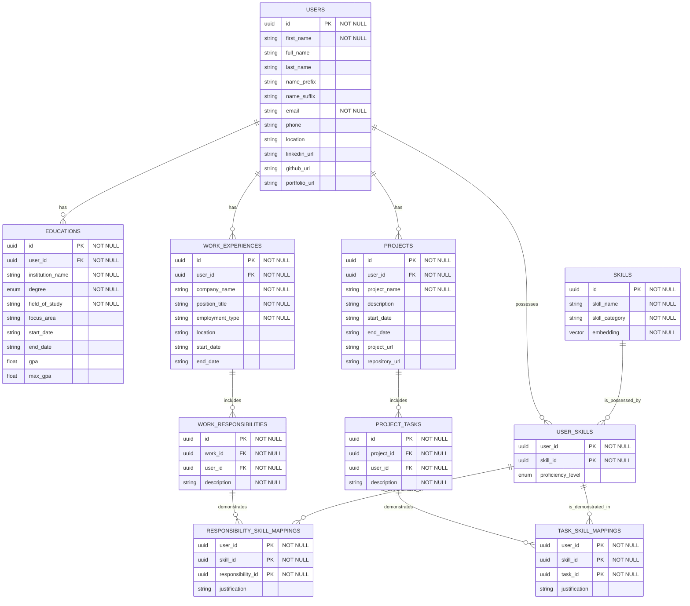

# Schema Design

## Database Schema



## Pydantic Schema Architecture

### Overview

The application uses a three-layer Pydantic schema architecture to handle different use cases:

1. **LLM Schemas** - For AI extraction with all optional fields
2. **Frontend Schemas** - For validation with required fields defined
3. **Response Schemas** - For API responses combining data with validation status

### Directory Structure

```
src/
├── schemas/
│   ├── __init__.py
│   ├── llm/           # AI output schemas (all optional)
│   │   ├── __init__.py
│   │   ├── user.py
│   │   ├── education.py
│   │   ├── work.py
│   │   ├── project.py
│   │   └── skill.py
│   ├── frontend/      # Frontend validation schemas
│   │   ├── __init__.py
│   │   ├── user.py
│   │   ├── education.py
│   │   ├── work.py
│   │   ├── project.py
│   │   └── skill.py
│   ├── response/      # API response schemas
│   │   ├── __init__.py
│   │   └── validation.py
│   └── converters/    # Conversion utilities
│       ├── __init__.py
│       └── db_converters.py
```

### Model Interaction Flow

#### 1. LLM Extraction Flow

When extracting from a resume or text using an LLM:

```
Resume PDF/Text → LLM (with UserLLMSchema structure) → UserLLMSchema instance
```

The LLM Schema has all optional fields, allowing the AI to extract whatever it can find:

```python
class UserLLMSchema(BaseModel):
    # Everything optional - LLM fills what it finds
    first_name: Optional[str] = None
    last_name: Optional[str] = None
    email: Optional[EmailStr] = None
    phone: Optional[str] = None
    educations: List[EducationLLMSchema] = []
    work_experiences: List[WorkExperienceLLMSchema] = []
    skills: List[SkillLLMSchema] = []
```

#### 2. Validation Against Frontend Requirements

After LLM extraction, the system validates against frontend requirements:

```python
# After LLM extraction:
extracted_data = UserLLMSchema(...)  # From LLM
frontend_requirements = UserFrontendSchema.model_fields  # Get required fields

# Validation service checks:
validator.validate(extracted_data, frontend_requirements)
→ Returns: ValidationResponse
```

The Frontend Schema defines what fields the UI actually needs:

```python
class UserFrontendSchema(BaseModel):
    # Mix of required and optional - defines UI needs
    first_name: str  # REQUIRED - UI won't work without this
    last_name: str   # REQUIRED
    email: EmailStr  # REQUIRED
    phone: Optional[str] = None  # Optional in UI
    
    class Config:
        # This generates JSON schema with "required" array
        # Frontend uses this to know what to validate
        schema_extra = {
            "required_fields_description": {
                "first_name": "User's first name is required for display",
                "email": "Email is required for account creation"
            }
        }
```

#### 3. API Response to Frontend

The API returns a comprehensive validation response:

```python
class ValidationResponse(BaseModel):
    # The extracted data (may be incomplete)
    data: UserLLMSchema
    
    # Validation against frontend requirements
    validation_status: Literal["complete", "incomplete", "invalid"]
    missing_required_fields: List[FieldInfo]  # Detailed field info
    field_errors: Dict[str, str]  # Validation errors per field
    completeness_percentage: float  # How complete the data is
    
    # Schema information for frontend
    frontend_schema: Dict  # JSON schema of required fields
```

Example response:

```json
{
  "data": {
    "first_name": "John",
    "email": "john@example.com",
    "educations": [...],
    // last_name is missing
  },
  "validation_status": "incomplete",
  "missing_required_fields": [
    {
      "field_name": "last_name",
      "field_type": "string",
      "description": "User's last name",
      "ui_label": "Last Name"
    }
  ],
  "completeness_percentage": 85.5,
  "frontend_schema": {
    "required": ["first_name", "last_name", "email"],
    "properties": {...}
  }
}
```

#### 4. Frontend Processing

The frontend receives the response and can:
- Display extracted data in form fields
- Highlight missing required fields
- Show completion percentage
- Prevent submission until required fields are filled
- Show helpful tooltips about what's missing

#### 5. Database Conversion Flow

When ready to save (all required fields present):

```python
# Convert to database model
llm_data = UserLLMSchema(...)
db_user = llm_data.to_db_model()  # Creates User with UUID
db_educations = [edu.to_db_model(user_id=db_user.id) for edu in llm_data.educations]

# Save to database
session.add(db_user)
session.add_all(db_educations)
```

#### 6. Schema Converter Pattern

The bridge between schemas:

```python
class SchemaConverter:
    @staticmethod
    def llm_to_frontend_validation(
        llm_data: UserLLMSchema,
        frontend_schema: Type[UserFrontendSchema]
    ) -> ValidationResponse:
        # Check which required fields are missing
        missing = []
        for field_name, field_info in frontend_schema.model_fields.items():
            if field_info.is_required():
                value = getattr(llm_data, field_name, None)
                if value is None or value == "":
                    missing.append(field_name)
        
        return ValidationResponse(
            data=llm_data,
            missing_required_fields=missing,
            validation_status="complete" if not missing else "incomplete"
        )
```

#### 7. Incremental Updates

Users can manually fill missing fields:

```python
# User manually fills missing fields in frontend
frontend_update = {"last_name": "Doe"}  # User input

# Merge with LLM extracted data
merged_data = llm_data.model_copy(update=frontend_update)

# Re-validate
new_validation = validator.validate(merged_data, UserFrontendSchema)
# Now validation_status might be "complete"
```

### Data Flow Pipeline

```
Raw Text → [LLM Schema] → [Validation Layer] → [Frontend Schema Check] → [Database Models]
                ↑                    ↓
          (All optional)    (Returns what's missing)
```

### Key Benefits

1. **Flexibility**: LLM can extract partial data without failing
2. **Transparency**: Frontend knows exactly what's missing
3. **Progressive Enhancement**: Users can fill gaps in LLM extraction
4. **Type Safety**: Full Pydantic validation at each layer
5. **Clear Separation**: AI extraction logic separate from business requirements

### Implementation Notes

#### Dual Schema Pattern Example

```python
# LLM Schema (all optional for AI extraction)
class EducationLLMSchema(BaseModel):
    institution_name: Optional[str] = None
    degree: Optional[DegreeType] = None
    field_of_study: Optional[str] = None
    focus_area: Optional[str] = None
    start_date: Optional[str] = None
    end_date: Optional[str] = None
    gpa: Optional[float] = None
    max_gpa: Optional[float] = None

# Frontend Schema (with requirements)
class EducationFrontendSchema(BaseModel):
    institution_name: str  # Required
    degree: DegreeType    # Required
    field_of_study: str   # Required
    focus_area: Optional[str] = None
    start_date: Optional[str] = None
    end_date: Optional[str] = None
    gpa: Optional[float] = None
    max_gpa: Optional[float] = None
```

#### Field Metadata System

Use Pydantic Field() with metadata for rich field information:

```python
from pydantic import Field

class UserFrontendSchema(BaseModel):
    first_name: str = Field(
        ...,
        description="User's first name",
        json_schema_extra={
            "ui_label": "First Name",
            "ui_hint": "Enter your first name as it appears on official documents",
            "llm_context": "Extract the person's given name or first name"
        }
    )
```

This architecture ensures that AI extraction remains flexible while maintaining strict validation for business requirements, creating a seamless experience for both automated extraction and manual data entry.
