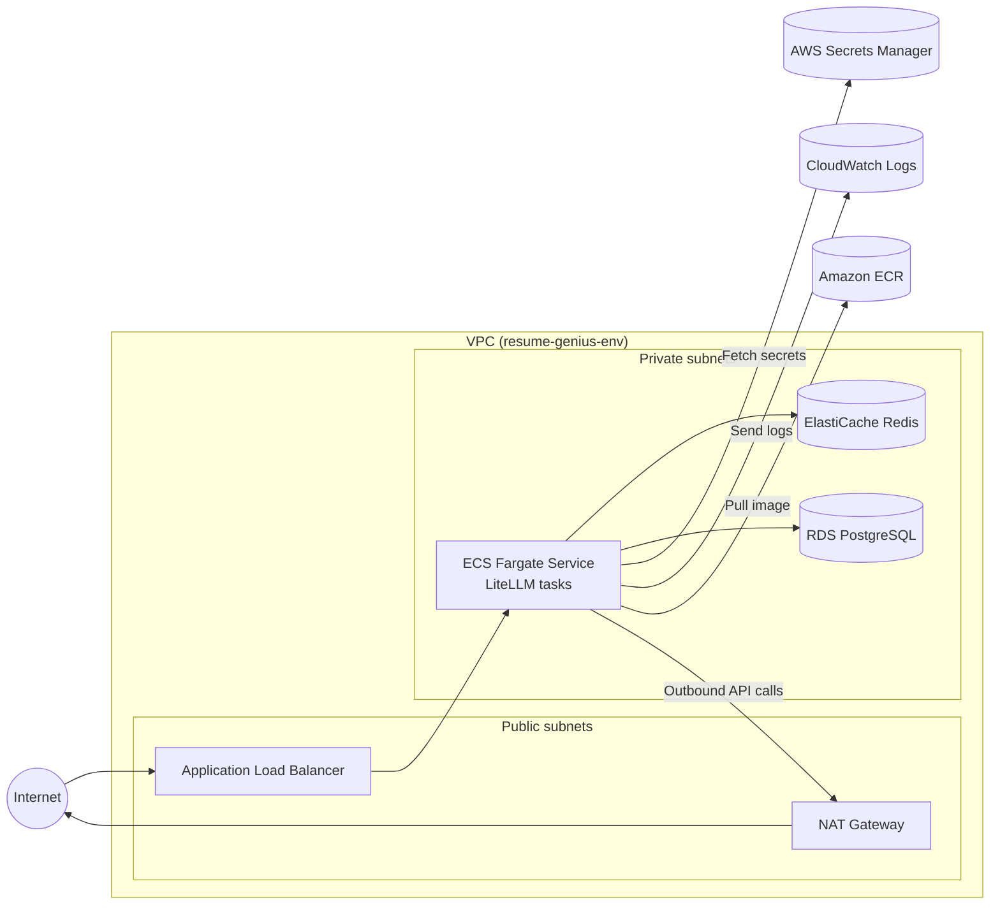

# LiteLLM on AWS (Terraform)

This Terraform configuration provisions the AWS infrastructure required to run LiteLLM behind an ECS Fargate service with managed PostgreSQL (RDS) and Redis (ElastiCache). The layout is intentionally modular so you can re-use the components for other environments (dev/staging/prod).

## Layout

- `modules/network` – VPC, subnets, routing, optional NAT gateway.
- `modules/rds_postgres` – Encrypted PostgreSQL instance, subnet group, security group rules (re-used for LiteLLM and the Resume Genius backend).
- `modules/elasticache_redis` – Redis replication group with encryption and access control.
- `modules/ecs_litellm` – ECS cluster/service, ALB, IAM roles, CloudWatch logs.
- `environments/dev` – Sample stack wiring the modules together. Duplicate this folder per environment.

## Architecture Overview

The Terraform stack builds a private VPC with public subnets for ingress and private subnets for application and data tiers. The diagram below highlights how traffic and dependencies flow through the environment:



## Prerequisites

1. **Terraform** `>= 1.6`.
2. **AWS credentials** with permissions to manage VPC, ECS, RDS, ElastiCache, IAM, ALB, CloudWatch.
3. **State backend** – Update `environments/dev/versions.tf` with your S3 bucket and DynamoDB table for locking before the first `terraform init`.
4. **Container image** – The LiteLLM image (with `config.yaml` baked in) must be published to ECR prior to deployment.
5. **Secrets** – Store API keys, LiteLLM master key, database URL, etc. in AWS Secrets Manager or SSM Parameter Store and supply their ARNs via `litellm_secrets`.

## Usage

```bash
# Step 1: Bootstrap remote backend (run once)
cd infrastructure/terraform/bootstrap
cp terraform.tfvars.example terraform.tfvars
# edit terraform.tfvars with unique bucket/table names (e.g. resume-genius-tf-state-ap-sg / resume-genius-tf-lock-ap-sg)
terraform init -backend=false
terraform apply

# Step 2: Provision LiteLLM environment (after backend exists)
cd infrastructure/terraform/environments/dev
cp terraform.tfvars.example terraform.tfvars
# edit terraform.tfvars with real values, secret ARNs, subnets, etc.
terraform init
terraform plan
terraform apply
```

Key variables:

- `availability_zones` – AZs that match your subnets.
- `litellm_container_image` – e.g. `ACCOUNT_ID.dkr.ecr.REGION.amazonaws.com/litellm:main`.
- `litellm_secrets` – map of environment variable names to secret ARNs.
- `rds_master_password`, `redis_auth_token_secret_arn` – inject secure values via tfvars or environment variables when planning/applying.
- `alb_https_certificate_arn` – optional ACM certificate for enabling HTTPS at the load balancer.

Outputs include the ALB DNS name, ECS service/cluster identifiers, datastore endpoints, and the Secrets Manager ARN for the backend database credentials.

### Backend application database

1. Update `environments/dev/terraform.tfvars` with `backend_rds_master_username`, `backend_rds_database_name`, and an optional `backend_rds_secret_name` to control how the secret appears in Secrets Manager.
2. Run `terraform -chdir=environments/dev plan` and `terraform -chdir=environments/dev apply`. Terraform provisions a separate `db.t4g.micro` instance, generates a strong password, and writes a JSON payload (`engine`, `host`, `port`, `username`, `password`, `dbname`, `url`) to the named secret.
3. Grant your backend runtime IAM access to `backend_rds_secret_arn` and attach the exported `backend_security_group_id` so it can reach the database over port 5432. Use the `url` field to populate `BACKEND_DATABASE_URL` for the FastAPI service.
4. Defaults are tuned for cost-effective development (single AZ, 20 GB storage, 1-day backups, deletion protection off). Override the `backend_rds_*` variables when you need higher durability or capacity.

## Extending

- Duplicate `environments/dev` for additional stages and adjust the backend key + `environment` variable.
- Attach extra security groups to `additional_*_allowed_security_group_ids` when other services need datastore access.
- Override ECS sizing (`litellm_task_cpu`, `litellm_task_memory`, `litellm_desired_count`) and ALB settings through variables.
- When `litellm_manual_control_enabled` and `backend_db_bastion_enabled` are set to `true`, the **LiteLLM manual override API** + bastion combo can keep the service online for a fixed window. Capture the outputs `litellm_manual_control_api_url`, `backend_rds_endpoint`, and `backend_db_bastion_instance_id`, then use `scripts/litellm-boost.sh 4` to request a four-hour boost. The script will start the bastion, open an SSM port forward to RDS, update `.env`, and stop the instance when you exit.

## Known Issues

- The backend PostgreSQL database (and its bastion host + manual override API) can be disabled by setting `backend_rds_enabled = false`, `backend_db_bastion_enabled = false`, and `litellm_manual_control_enabled = false` in your environment `terraform.tfvars`. We have encountered intermittent connectivity problems with the SSM-managed bastion on Ubuntu images; the current workaround is to keep the database stack disabled until the access pattern is stabilised.
- `scripts/litellm-boost.sh` now only enforces the LiteLLM ECS service desired count (no more port forwarding). Use `./scripts/litellm-boost.sh` to scale up to one task and `./scripts/litellm-boost.sh --off` to scale back down.

> **Security tip:** Avoid committing real secrets. Populate them through Terraform Cloud/Terragrunt variables, or pass with `TF_VAR_` environment variables during workflows.

### Enabling HTTPS

1. Request or import an ACM certificate in the target AWS region (e.g. `ap-southeast-1`).
2. Update your environment `terraform.tfvars` with:
   - `alb_https_certificate_arn = "arn:aws:acm:REGION:ACCOUNT:certificate/ID"`
   - (Optional) `alb_redirect_http_to_https = true` to issue an ALB redirect from port 80 to 443.
3. Ensure the certificate’s domain names point at the ALB’s DNS name via CNAME/ALIAS records.
4. Apply Terraform; it creates an HTTPS listener that terminates TLS with the provided certificate.
